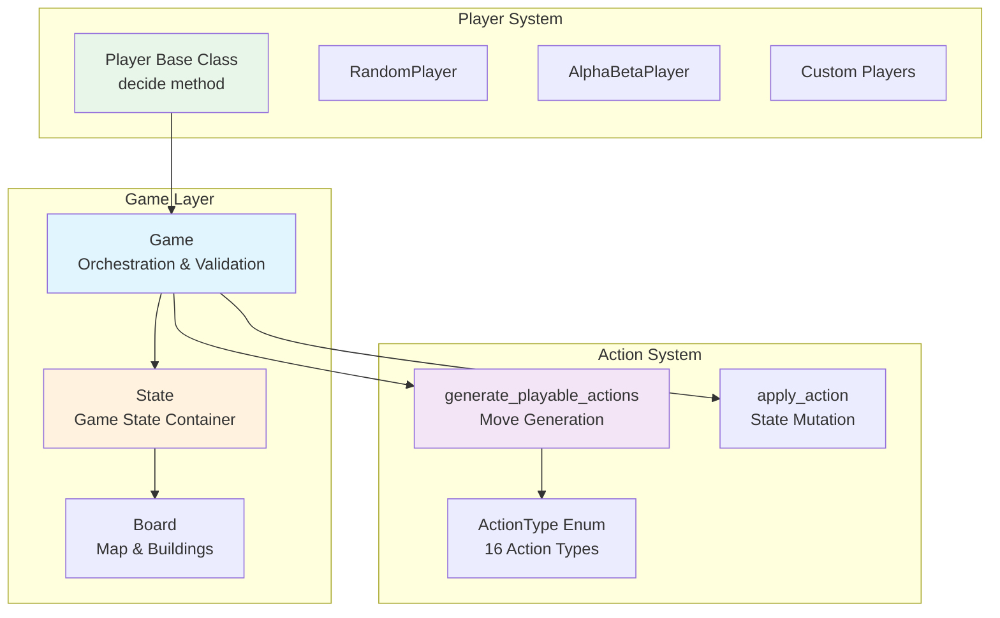
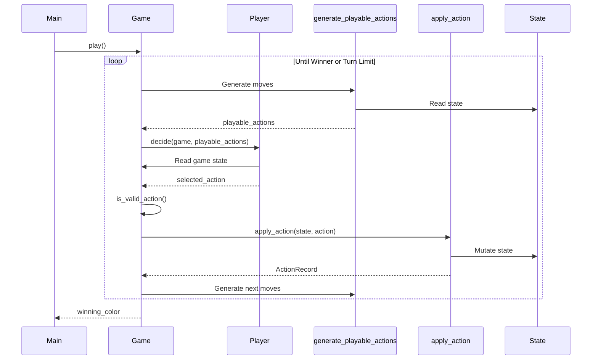
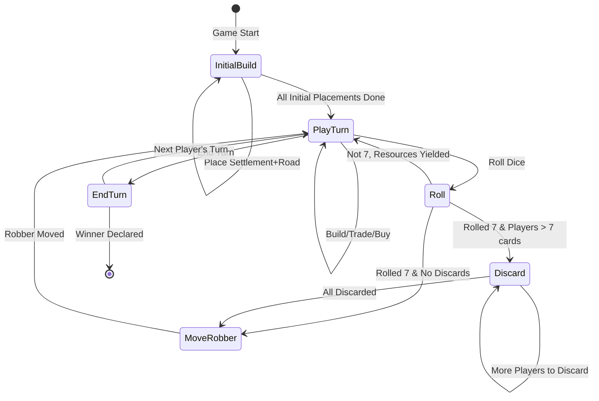
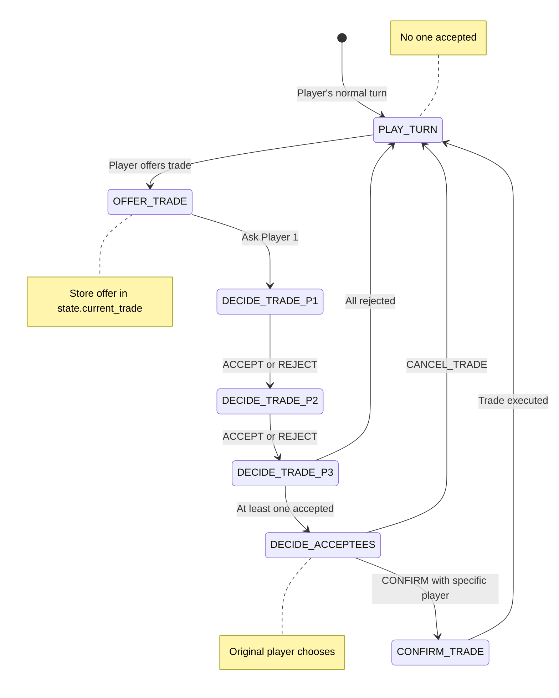
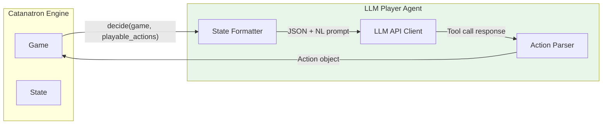
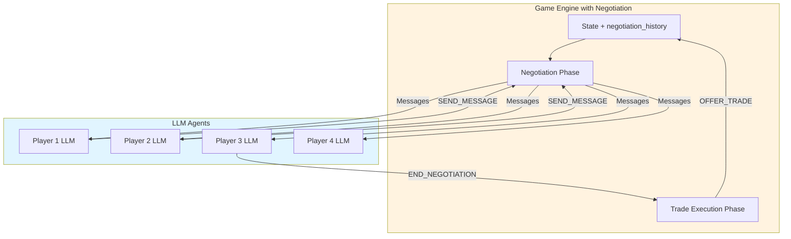
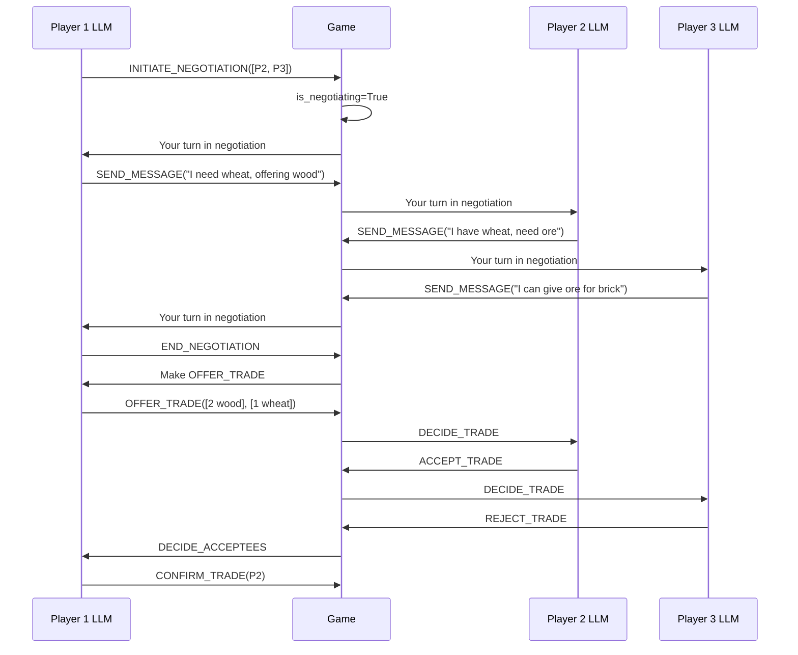

# Catanatron Game Engine Architecture

## Table of Contents

1. [Overview](#overview)
2. [Core Architecture](#core-architecture)
3. [Action System](#action-system)
4. [Game State Management](#game-state-management)
5. [Player Interface](#player-interface)
6. [Trade System Deep Dive](#trade-system-deep-dive)
7. [LLM Agent Integration](#llm-agent-integration)
8. [Implementation Guide](#implementation-guide)
9. [Code Examples](#code-examples)

---

## Overview

Catanatron is a fast, pure-Python implementation of the Settlers of Catan game engine designed for AI research and experimentation. The architecture follows a clean separation of concerns with an immutable action system and pluggable player implementations.

### Key Design Principles

- **Immutable Actions**: Actions are represented as namedtuples that describe intent
- **Redux-like Pattern**: State changes happen through explicit action handlers
- **Pluggable Players**: All player logic is encapsulated in Player subclasses
- **Deterministic Replay**: ActionRecords allow full game reconstruction
- **Performance**: Optimized for running thousands of simulations

### High-Level Architecture



---

## Core Architecture

### 1. Game Class (`catanatron/game.py`)

The `Game` class is the main entry point and orchestrator for the game. It's a thin wrapper around the `State` class that manages the game loop and player interactions.

#### Responsibilities

- **Initialization**: Sets up the game with players, seed, map, and victory conditions
- **Game Loop**: Orchestrates turns through `play()` and `play_tick()` methods
- **Action Validation**: Validates actions before execution via `is_valid_action()`
- **Accumulator Hooks**: Provides lifecycle hooks for data collection
- **Winner Detection**: Determines when a player reaches victory points

#### Key Attributes

```python
class Game:
    state: State                    # Current game state
    playable_actions: List[Action]  # Valid actions for current player
    seed: int                       # Random seed for reproducibility
    id: str                         # Unique game identifier
    vps_to_win: int                 # Victory points needed (default: 10)
```

#### Game Loop Flow



#### Game Loop Methods

**`play(accumulators=[], decide_fn=None)`**

Executes the entire game until completion or turn limit.

- **accumulators**: List of `GameAccumulator` instances for data collection
- **decide_fn**: Optional function to override player decisions (for testing)
- **Returns**: Winning color or `None` if turn limit exceeded

**`play_tick(decide_fn=None, accumulators=[])`**

Advances the game by one ply (single player decision).

- Calls current player's `decide()` method
- Executes the returned action
- Generates next set of playable actions
- **Returns**: `ActionRecord` of the executed action

**`execute(action, validate_action=True, action_record=None)`**

Internal method that executes a validated action.

- Validates action if `validate_action=True`
- Calls `apply_action()` to mutate state
- Regenerates playable actions
- **Returns**: `ActionRecord`

### 2. State Class (`catanatron/state.py`)

The `State` class is the central data structure containing all game state information. It's designed to be efficiently copyable for tree search algorithms.

#### Core State Components

```python
class State:
    # Players and turn management
    players: List[Player]           # DEPRECATED: Use colors instead
    colors: Tuple[Color]           # Seating order (immutable)
    color_to_index: Dict[Color, int]  # Color lookup cache
    current_player_index: int      # Who decides next
    current_turn_index: int        # Whose turn it is
    num_turns: int                 # Completed turns counter
    
    # Board state
    board: Board                   # Map, buildings, roads, robber
    
    # Player state (flat dictionary for performance)
    player_state: Dict[str, Any]   # Format: P{index}_{ATTRIBUTE}
    
    # Resources and cards
    resource_freqdeck: List[int]   # Bank's resources [W,B,S,W,O]
    development_listdeck: List[FastDevCard]  # Shuffled dev cards
    
    # Buildings cache (for performance)
    buildings_by_color: Dict[Color, Dict[FastBuildingType, List]]
    
    # Action history
    action_records: List[ActionRecord]  # Full game log
    
    # Game phase indicators
    current_prompt: ActionPrompt    # Current game phase
    is_initial_build_phase: bool
    is_discarding: bool
    is_moving_knight: bool
    is_road_building: bool
    free_roads_available: int
    
    # Trade state
    is_resolving_trade: bool
    current_trade: Tuple            # (offer[5], ask[5], turn_idx)
    acceptees: Tuple[bool]          # Who accepted trade
    
    discard_limit: int              # Cards before discarding (default: 7)
```

#### Player State Dictionary

The `player_state` dictionary is a flat structure optimized for performance and feature extraction. Each player's state is prefixed with `P{index}_`.

**Format Example**: For player at index 0 (P0):

```python
{
    # Victory Points
    "P0_VICTORY_POINTS": 2,          # Public VPs (visible to all)
    "P0_ACTUAL_VICTORY_POINTS": 3,   # Includes hidden VP cards
    
    # Resources in hand (visible only to P0)
    "P0_WOOD_IN_HAND": 2,
    "P0_BRICK_IN_HAND": 1,
    "P0_SHEEP_IN_HAND": 3,
    "P0_WHEAT_IN_HAND": 1,
    "P0_ORE_IN_HAND": 0,
    
    # Development cards
    "P0_KNIGHT_IN_HAND": 1,
    "P0_YEAR_OF_PLENTY_IN_HAND": 0,
    "P0_MONOPOLY_IN_HAND": 0,
    "P0_ROAD_BUILDING_IN_HAND": 1,
    "P0_VICTORY_POINT_IN_HAND": 1,
    
    # Played development cards (visible to all)
    "P0_PLAYED_KNIGHT": 2,
    "P0_PLAYED_YEAR_OF_PLENTY": 0,
    "P0_PLAYED_MONOPOLY": 0,
    "P0_PLAYED_ROAD_BUILDING": 1,
    
    # Building inventory
    "P0_ROADS_AVAILABLE": 13,
    "P0_SETTLEMENTS_AVAILABLE": 3,
    "P0_CITIES_AVAILABLE": 4,
    
    # Special achievements
    "P0_HAS_ROAD": True,             # Longest road
    "P0_HAS_ARMY": False,            # Largest army
    "P0_LONGEST_ROAD_LENGTH": 7,
    
    # Turn state
    "P0_HAS_ROLLED": True,
    "P0_HAS_PLAYED_DEVELOPMENT_CARD_IN_TURN": False,
    
    # Dev card playability tracking
    "P0_KNIGHT_OWNED_AT_START": True,  # Can play this turn
    "P0_MONOPOLY_OWNED_AT_START": False,
    "P0_YEAR_OF_PLENTY_OWNED_AT_START": False,
    "P0_ROAD_BUILDING_OWNED_AT_START": True,
}
```

#### State Copying

The `State.copy()` method creates a deep copy for simulations:

```python
def copy(self) -> State:
    """Creates independent copy for tree search without affecting original"""
    state_copy = State([], None, initialize=False)
    state_copy.players = self.players  # Reference (immutable)
    state_copy.board = self.board.copy()
    state_copy.player_state = self.player_state.copy()
    state_copy.resource_freqdeck = self.resource_freqdeck.copy()
    # ... copies all mutable structures
    return state_copy
```

### 3. Board Class (`catanatron/models/board.py`)

The `Board` class manages the physical game board: tiles, nodes (settlement locations), edges (road locations), and ports.

#### Key Components

```python
class Board:
    map: CatanMap                  # Tile layout and topology
    buildings: Dict[int, Tuple]    # node_id -> (Color, BuildingType)
    roads: Dict[Tuple, Color]      # (node1, node2) -> Color
    robber_coordinate: Coordinate  # Current robber location
```

#### Board Operations

- **`buildable_node_ids(color, initial_build_phase=False)`**: Returns valid settlement locations
- **`buildable_edges(color)`**: Returns valid road locations
- **`build_settlement(color, node_id, is_free)`**: Places settlement, returns road impact
- **`build_city(color, node_id)`**: Upgrades settlement to city
- **`build_road(color, edge)`**: Places road, calculates longest road
- **`get_player_port_resources(color)`**: Returns accessible port types

---

## Action System

The action system is built on immutable data structures and explicit action types. All actions flow through a single `apply_action()` function that routes to specific handlers.

### Action Representation

```python
from collections import namedtuple

Action = namedtuple("Action", ["color", "action_type", "value"])
ActionRecord = namedtuple("ActionRecord", ["action", "result"])
```

**Action Fields**:
- **color**: `Color` enum of the player taking the action
- **action_type**: `ActionType` enum indicating the action category
- **value**: Polymorphic parameter specific to action_type

**ActionRecord Fields**:
- **action**: The `Action` that was executed
- **result**: Result of non-deterministic actions (dice rolls, cards drawn, etc.)

### ActionType Enum

There are **16 action types** divided into categories:

```python
class ActionType(Enum):
    # Turn management
    ROLL = "ROLL"                  # value: None
    END_TURN = "END_TURN"          # value: None
    DISCARD = "DISCARD"            # value: None (random) or List[Resource]
    MOVE_ROBBER = "MOVE_ROBBER"    # value: (coordinate, Color|None)
    
    # Building
    BUILD_ROAD = "BUILD_ROAD"              # value: (node_id, node_id)
    BUILD_SETTLEMENT = "BUILD_SETTLEMENT"  # value: node_id
    BUILD_CITY = "BUILD_CITY"              # value: node_id
    BUY_DEVELOPMENT_CARD = "BUY_DEVELOPMENT_CARD"  # value: None
    
    # Development cards
    PLAY_KNIGHT_CARD = "PLAY_KNIGHT_CARD"          # value: None
    PLAY_YEAR_OF_PLENTY = "PLAY_YEAR_OF_PLENTY"    # value: (Resource, Resource)
    PLAY_MONOPOLY = "PLAY_MONOPOLY"                # value: Resource
    PLAY_ROAD_BUILDING = "PLAY_ROAD_BUILDING"      # value: None
    
    # Trade
    MARITIME_TRADE = "MARITIME_TRADE"    # value: (R,R,R,R,R_asked) or with None
    OFFER_TRADE = "OFFER_TRADE"          # value: (offer[5], ask[5])
    ACCEPT_TRADE = "ACCEPT_TRADE"        # value: (offer[5], ask[5], turn_idx)
    REJECT_TRADE = "REJECT_TRADE"        # value: (offer[5], ask[5], turn_idx)
    CONFIRM_TRADE = "CONFIRM_TRADE"      # value: (offer[5], ask[5], Color)
    CANCEL_TRADE = "CANCEL_TRADE"        # value: None
```

### ActionPrompt Enum

The `ActionPrompt` indicates what type of decision is expected from the current player:

```python
class ActionPrompt(Enum):
    BUILD_INITIAL_SETTLEMENT = "BUILD_INITIAL_SETTLEMENT"
    BUILD_INITIAL_ROAD = "BUILD_INITIAL_ROAD"
    PLAY_TURN = "PLAY_TURN"               # Normal turn actions
    DISCARD = "DISCARD"                   # Must discard half
    MOVE_ROBBER = "MOVE_ROBBER"           # After 7 or knight
    DECIDE_TRADE = "DECIDE_TRADE"         # Accept/reject trade offer
    DECIDE_ACCEPTEES = "DECIDE_ACCEPTEES"  # Choose who to trade with
```

### Action Generation (`catanatron/models/actions.py`)

The `generate_playable_actions(state)` function is called after every state change to produce the list of valid actions for the current player.

#### Generation Logic by Prompt

```python
def generate_playable_actions(state: State) -> List[Action]:
    action_prompt = state.current_prompt
    color = state.current_color()
    
    if action_prompt == ActionPrompt.BUILD_INITIAL_SETTLEMENT:
        return settlement_possibilities(state, color, True)
    
    elif action_prompt == ActionPrompt.BUILD_INITIAL_ROAD:
        return initial_road_possibilities(state, color)
    
    elif action_prompt == ActionPrompt.MOVE_ROBBER:
        return robber_possibilities(state, color)
    
    elif action_prompt == ActionPrompt.PLAY_TURN:
        if state.is_road_building:
            return road_building_possibilities(state, color, False)
        
        actions = []
        
        # Dev cards (playable before and after rolling)
        if player_can_play_dev(state, color, "YEAR_OF_PLENTY"):
            actions.extend(year_of_plenty_possibilities(color, state.resource_freqdeck))
        if player_can_play_dev(state, color, "MONOPOLY"):
            actions.extend(monopoly_possibilities(color))
        if player_can_play_dev(state, color, "KNIGHT"):
            actions.append(Action(color, ActionType.PLAY_KNIGHT_CARD, None))
        if player_can_play_dev(state, color, "ROAD_BUILDING"):
            actions.append(Action(color, ActionType.PLAY_ROAD_BUILDING, None))
        
        if not player_has_rolled(state, color):
            actions.append(Action(color, ActionType.ROLL, None))
        else:
            # After rolling
            actions.append(Action(color, ActionType.END_TURN, None))
            actions.extend(road_building_possibilities(state, color))
            actions.extend(settlement_possibilities(state, color))
            actions.extend(city_possibilities(state, color))
            
            if player_can_afford_dev_card(state, color):
                actions.append(Action(color, ActionType.BUY_DEVELOPMENT_CARD, None))
            
            actions.extend(maritime_trade_possibilities(state, color))
        
        return actions
    
    elif action_prompt == ActionPrompt.DISCARD:
        return discard_possibilities(color)
    
    elif action_prompt == ActionPrompt.DECIDE_TRADE:
        actions = [Action(color, ActionType.REJECT_TRADE, state.current_trade)]
        freqdeck = get_player_freqdeck(state, color)
        asked = state.current_trade[5:10]
        if freqdeck_contains(freqdeck, asked):
            actions.append(Action(color, ActionType.ACCEPT_TRADE, state.current_trade))
        return actions
    
    elif action_prompt == ActionPrompt.DECIDE_ACCEPTEES:
        actions = [Action(color, ActionType.CANCEL_TRADE, None)]
        for other_color, accepted in zip(state.colors, state.acceptees):
            if accepted:
                actions.append(Action(
                    color, ActionType.CONFIRM_TRADE,
                    (*state.current_trade[:10], other_color)
                ))
        return actions
```

### Action Application (`catanatron/apply_action.py`)

The `apply_action()` function is the single entry point for state mutations. It follows a Redux-like pattern:

```python
def apply_action(state: State, action: Action, action_record: ActionRecord = None) -> ActionRecord:
    """
    Main controller that routes actions to appropriate handlers.
    
    Responsibilities:
    - Mutate state according to action
    - Update current_player_index and current_prompt
    - Handle non-deterministic results (dice, card draws)
    - Append ActionRecord to state.action_records
    
    Returns:
        ActionRecord with action and result (if non-deterministic)
    """
    if action.action_type == ActionType.END_TURN:
        action_record = apply_end_turn(state, action)
    elif action.action_type == ActionType.BUILD_SETTLEMENT:
        action_record = apply_build_settlement(state, action)
    # ... routes to 16 different handlers
    
    state.action_records.append(action_record)
    return action_record
```

#### Action Handler Pattern

Each handler follows this pattern:

```python
def apply_{action_name}(state: State, action: Action, action_record=None):
    # 1. Validate preconditions (optional, done in is_valid_action)
    # 2. Handle non-deterministic results
    # 3. Mutate state
    # 4. Update current_player_index if needed
    # 5. Update current_prompt if needed
    # 6. Return ActionRecord
```

#### Example: Rolling Dice

```python
def apply_roll(state: State, action: Action, action_record=None):
    key = player_key(state, action.color)
    state.player_state[f"{key}_HAS_ROLLED"] = True
    
    # Use provided dice (for replay) or roll new ones
    dices = action_record.result if action_record else roll_dice()
    number = dices[0] + dices[1]
    action = Action(action.color, action.action_type, dices)
    
    if number == 7:
        # Check if anyone needs to discard
        discarders = [
            player_num_resource_cards(state, color) > state.discard_limit
            for color in state.colors
        ]
        
        if any(discarders):
            state.current_player_index = discarders.index(True)
            state.current_prompt = ActionPrompt.DISCARD
            state.is_discarding = True
        else:
            state.current_prompt = ActionPrompt.MOVE_ROBBER
            state.is_moving_knight = True
    else:
        # Yield resources
        payout, _ = yield_resources(state.board, state.resource_freqdeck, number)
        for color, resource_freqdeck in payout.items():
            player_freqdeck_add(state, color, resource_freqdeck)
            state.resource_freqdeck = freqdeck_subtract(
                state.resource_freqdeck, resource_freqdeck
            )
        state.current_prompt = ActionPrompt.PLAY_TURN
    
    return ActionRecord(action=action, result=dices)
```

---

## Game State Management

### Turn Management

The game uses two separate indices to handle out-of-turn actions:

- **`current_turn_index`**: Which player's turn it is (for resource collection, etc.)
- **`current_player_index`**: Which player needs to make a decision right now

These can differ during:
- Discarding phase (after rolling 7)
- Trade negotiation (other players accept/reject)
- Robber stealing (moving robber affects multiple players)

### Phase Transitions



### Frequency Decks (freqdeck)

Resources and some card types are represented as frequency arrays for performance:

```python
# Format: [WOOD, BRICK, SHEEP, WHEAT, ORE]
freqdeck = [2, 1, 3, 1, 0]  # 2 wood, 1 brick, 3 sheep, 1 wheat, 0 ore

# Helper functions
freqdeck_add(deck, other_deck)        # Add resources
freqdeck_subtract(deck, other_deck)   # Remove resources
freqdeck_contains(deck, other_deck)   # Can afford?
freqdeck_count(deck, resource)        # Count of resource
```

### Building Costs

```python
from catanatron.models.decks import (
    ROAD_COST_FREQDECK,        # [1, 1, 0, 0, 0] - Wood + Brick
    SETTLEMENT_COST_FREQDECK,  # [1, 1, 1, 1, 0] - W + B + S + Wh
    CITY_COST_FREQDECK,        # [0, 0, 0, 2, 3] - 2 Wheat + 3 Ore
    DEVELOPMENT_CARD_COST_FREQDECK,  # [0, 0, 1, 1, 1] - S + Wh + O
)
```

---

## Player Interface

### Base Player Class

All player implementations must extend the `Player` base class:

```python
class Player:
    """Interface for player decision logic"""
    
    def __init__(self, color: Color, is_bot: bool = True):
        self.color = color
        self.is_bot = is_bot
    
    def decide(self, game: Game, playable_actions: List[Action]) -> Action:
        """
        Called when this player needs to make a decision.
        
        Args:
            game: Complete game state (read-only)
            playable_actions: List of valid actions right now
        
        Returns:
            One Action from playable_actions, OR a valid OFFER_TRADE action
        
        Note:
            OFFER_TRADE can be returned during PLAY_TURN after rolling,
            even if not in playable_actions (special case).
        """
        raise NotImplementedError
    
    def reset_state(self):
        """Hook for resetting state between games"""
        pass
```

### Built-in Player Types

#### 1. RandomPlayer

Selects randomly from playable actions:

```python
class RandomPlayer(Player):
    def decide(self, game, playable_actions):
        return random.choice(playable_actions)
```

#### 2. SimplePlayer

Always takes first action (useful for testing):

```python
class SimplePlayer(Player):
    def decide(self, game, playable_actions):
        return playable_actions[0]
```

#### 3. AlphaBetaPlayer

Implements minimax with alpha-beta pruning:

```python
class AlphaBetaPlayer(Player):
    def __init__(self, color, depth=2, prunning=False, value_fn_builder_name=None):
        super().__init__(color)
        self.depth = depth
        self.prunning = prunning
    
    def decide(self, game, playable_actions):
        if len(playable_actions) == 1:
            return playable_actions[0]
        
        game_copy = game.copy()
        best_action, best_value = self.alphabeta(
            game_copy, self.depth, float("-inf"), float("inf"), deadline, node
        )
        return best_action or playable_actions[0]
```

### Accessing Game State

Players can access full game state through the `game` parameter:

```python
def decide(self, game: Game, playable_actions: List[Action]) -> Action:
    # Access state
    state = game.state
    
    # Current player info
    my_color = self.color
    my_key = player_key(state, my_color)
    my_resources = get_player_freqdeck(state, my_color)
    my_vps = state.player_state[f"{my_key}_ACTUAL_VICTORY_POINTS"]
    
    # Board info
    board = state.board
    my_settlements = state.buildings_by_color[my_color][SETTLEMENT]
    my_cities = state.buildings_by_color[my_color][CITY]
    
    # Other players
    for other_color in state.colors:
        if other_color == my_color:
            continue
        other_key = player_key(state, other_color)
        other_vps = state.player_state[f"{other_key}_VICTORY_POINTS"]
        other_num_cards = player_num_resource_cards(state, other_color)
    
    # Game phase
    current_prompt = state.current_prompt
    has_rolled = player_has_rolled(state, my_color)
    
    return choose_best_action(playable_actions)
```

### Feature Extraction

The `features.py` module provides utilities to convert game state to vectors:

```python
from catanatron.features import create_sample, create_sample_vector

def decide(self, game, playable_actions):
    # Get feature dictionary
    features = create_sample(game, self.color)
    # features = {
    #     "P0_ACTUAL_VPS": 3,
    #     "P0_WOOD_IN_HAND": 2,
    #     "BANK_WOOD": 15,
    #     "NODE0_P0_SETTLEMENT": True,
    #     ...
    # }
    
    # Or get as numpy array
    feature_names = get_feature_ordering(num_players=len(game.state.colors))
    vector = create_sample_vector(game, self.color, feature_names)
    
    return neural_network_decision(vector, playable_actions)
```

---

## Trade System Deep Dive

### Maritime Trade (Bank Trading)

Maritime trades are player-to-bank exchanges at fixed rates.

#### Trade Rates

- **4:1**: Default rate (no port)
- **3:1**: Three-to-one port (any resource)
- **2:1**: Specialized port (specific resource only)

#### Maritime Trade Action Format

```python
# value is 5-tuple: (give, give, give, give, get)
# Nones indicate unused slots (for port trades)

# 4:1 Example: Trade 4 wood for 1 ore
Action(color, ActionType.MARITIME_TRADE, (WOOD, WOOD, WOOD, WOOD, ORE))

# 3:1 Example: Trade 3 sheep for 1 brick
Action(color, ActionType.MARITIME_TRADE, (SHEEP, SHEEP, SHEEP, None, BRICK))

# 2:1 Example: Trade 2 wheat for 1 wood (wheat port)
Action(color, ActionType.MARITIME_TRADE, (WHEAT, WHEAT, None, None, WOOD))
```

#### Generation Logic

```python
def maritime_trade_possibilities(state, color) -> List[Action]:
    """Generates all valid maritime trades"""
    hand_freqdeck = get_player_freqdeck(state, color)
    port_resources = state.board.get_player_port_resources(color)
    # port_resources might contain None (3:1) or specific resources (2:1)
    
    trade_offers = set()
    
    # Determine rates per resource
    rates = {WOOD: 4, BRICK: 4, SHEEP: 4, WHEAT: 4, ORE: 4}
    if None in port_resources:
        rates = {WOOD: 3, BRICK: 3, SHEEP: 3, WHEAT: 3, ORE: 3}
    for resource in port_resources:
        if resource is not None:
            rates[resource] = 2
    
    # Generate trades
    for resource_out in RESOURCES:
        amount_owned = hand_freqdeck[RESOURCES.index(resource_out)]
        if amount_owned >= rates[resource_out]:
            resource_out_list = [resource_out] * rates[resource_out]
            resource_out_list += [None] * (4 - rates[resource_out])
            
            for resource_in in RESOURCES:
                if resource_in != resource_out:
                    if bank_has_resource(state, resource_in):
                        trade_offer = tuple(resource_out_list + [resource_in])
                        trade_offers.add(trade_offer)
    
    return [Action(color, ActionType.MARITIME_TRADE, t) for t in trade_offers]
```

### Domestic Trade (Player-to-Player)

Domestic trading is more complex, involving multiple phases and player decisions.

#### Trade State Machine



#### Trade Action Values

All domestic trade actions use a 10-tuple format:

```python
# Format: (offered_freqdeck[5], asked_freqdeck[5])
# Example: Offer 2 wood + 1 sheep for 1 wheat + 1 ore
trade_value = (
    2, 0, 1, 0, 0,  # Offering: 2 wood, 0 brick, 1 sheep, 0 wheat, 0 ore
    0, 0, 0, 1, 1   # Asking: 0 wood, 0 brick, 0 sheep, 1 wheat, 1 ore
)
```

#### Trade Validation

```python
def is_valid_trade(action_value):
    """Validates trade offer structure"""
    offering = action_value[:5]
    asking = action_value[5:]
    
    # Can't give away resources for free
    if sum(offering) == 0 or sum(asking) == 0:
        return False
    
    # Can't trade same resource both ways
    for i, j in zip(offering, asking):
        if i > 0 and j > 0:
            return False
    
    return True
```

#### Phase-by-Phase Breakdown

**1. OFFER_TRADE (Proposer's Turn)**

```python
# Player creates offer during PLAY_TURN (after rolling)
offering = [2, 0, 0, 0, 0]  # 2 wood
asking = [0, 1, 0, 0, 0]    # 1 brick
action = Action(my_color, ActionType.OFFER_TRADE, tuple(offering + asking))

# State changes:
# - is_resolving_trade = True
# - current_trade = (*action.value, current_turn_index)
# - current_player_index = first other player
# - current_prompt = ActionPrompt.DECIDE_TRADE
```

**2. DECIDE_TRADE (Other Players Respond)**

Each other player is prompted in seating order:

```python
# Generated actions for responder:
actions = [
    Action(responder_color, ActionType.REJECT_TRADE, current_trade),
]

# Can only accept if has the resources
if has_resources(responder, current_trade[5:10]):
    actions.append(
        Action(responder_color, ActionType.ACCEPT_TRADE, current_trade)
    )
```

After each response:
- If ACCEPT: Add to `state.acceptees` tuple
- Move to next player
- If no more players: goto DECIDE_ACCEPTEES or back to PLAY_TURN

**3. DECIDE_ACCEPTEES (Proposer Chooses)**

If at least one player accepted:

```python
# Generated actions for proposer:
actions = [Action(proposer_color, ActionType.CANCEL_TRADE, None)]

for other_color, accepted in zip(state.colors, state.acceptees):
    if accepted:
        actions.append(Action(
            proposer_color,
            ActionType.CONFIRM_TRADE,
            (*state.current_trade[:10], other_color)
        ))
```

**4. CONFIRM_TRADE (Execute Trade)**

```python
def apply_confirm_trade(state, action):
    offering = action.value[:5]
    asking = action.value[5:10]
    trading_partner = action.value[10]
    
    # Transfer resources
    player_freqdeck_subtract(state, action.color, offering)
    player_freqdeck_add(state, action.color, asking)
    player_freqdeck_subtract(state, trading_partner, asking)
    player_freqdeck_add(state, trading_partner, offering)
    
    # Reset trade state
    state.is_resolving_trade = False
    state.current_trade = (0,0,0,0,0,0,0,0,0,0,0)
    state.acceptees = tuple(False for _ in state.colors)
    
    # Back to original player's turn
    state.current_player_index = state.current_turn_index
    state.current_prompt = ActionPrompt.PLAY_TURN
```

#### Current Limitations

**No Negotiation**: The current system has NO negotiation mechanism:
- Trade offers are immutable once created
- No counter-offers
- No communication between players
- No reasoning or persuasion
- Accept/reject is purely based on game state

**For LLM integration, you will need to add**:
1. A negotiation phase before OFFER_TRADE
2. Message passing between players
3. History tracking
4. Natural language understanding/generation

---

## LLM Agent Integration

### Integration Challenges

Integrating LLM agents with Catanatron requires addressing several challenges:

1. **State Representation**: Converting game state to LLM-readable format
2. **Action Space**: Mapping between natural language and Action objects
3. **Negotiation**: Adding communication capabilities to the trade system
4. **Tool Calling**: Exposing game actions as LLM tools
5. **Multi-Agent Coordination**: Managing multiple LLM agents in one game
6. **Performance**: LLM API latency vs game simulation speed

### Architecture Options

#### Option A: LLM Player Wrapper (Recommended for MVP)

Wrap the Player class with LLM API calls:



**Advantages**:
- Minimal engine modifications
- Clean separation of concerns
- Easy to swap LLM providers
- Can mix LLM and traditional AI players

**Disadvantages**:
- Negotiation requires new action types
- Each decision is isolated (no conversation state)
- Performance bottleneck at LLM API

#### Option B: Negotiation-First Architecture (Recommended for Full System)

Add a negotiation layer to the engine:



### Recommended Hybrid Approach

For all-LLM games with natural language negotiation, use a hybrid:

#### 1. LLM Player Base Class

```python
import anthropic  # or openai
from typing import List, Dict, Any
import json

class LLMPlayer(Player):
    """Base class for LLM-powered players"""
    
    def __init__(self, color: Color, api_key: str, model: str = "claude-3-5-sonnet-20241022"):
        super().__init__(color, is_bot=True)
        self.client = anthropic.Anthropic(api_key=api_key)
        self.model = model
        self.conversation_history = []
    
    def decide(self, game: Game, playable_actions: List[Action]) -> Action:
        """
        Make decision using LLM with tool calling.
        """
        # Format game state
        state_json = self.format_state_json(game)
        state_summary = self.format_state_natural_language(game)
        
        # Build system prompt
        system_prompt = self.build_system_prompt()
        
        # Build user message
        user_message = f"""
        {state_summary}
        
        Current game state (detailed):
        ```json
        {json.dumps(state_json, indent=2)}
        ```
        
        You must now make a decision. Use the available tools to choose your action.
        """
        
        # Define tools
        tools = self.create_action_tools(playable_actions)
        
        # Call LLM
        response = self.client.messages.create(
            model=self.model,
            max_tokens=4096,
            system=system_prompt,
            messages=[
                *self.conversation_history,
                {"role": "user", "content": user_message}
            ],
            tools=tools
        )
        
        # Parse response
        action = self.parse_llm_response(response, playable_actions)
        
        # Update conversation history
        self.conversation_history.append({"role": "user", "content": user_message})
        self.conversation_history.append({"role": "assistant", "content": response.content})
        
        return action
    
    def format_state_json(self, game: Game) -> Dict[str, Any]:
        """Convert game state to structured JSON"""
        state = game.state
        my_key = player_key(state, self.color)
        
        return {
            "my_color": self.color.value,
            "turn_number": state.num_turns,
            "my_resources": {
                "wood": state.player_state[f"{my_key}_WOOD_IN_HAND"],
                "brick": state.player_state[f"{my_key}_BRICK_IN_HAND"],
                "sheep": state.player_state[f"{my_key}_SHEEP_IN_HAND"],
                "wheat": state.player_state[f"{my_key}_WHEAT_IN_HAND"],
                "ore": state.player_state[f"{my_key}_ORE_IN_HAND"],
            },
            "my_development_cards": {
                "knight": state.player_state[f"{my_key}_KNIGHT_IN_HAND"],
                "year_of_plenty": state.player_state[f"{my_key}_YEAR_OF_PLENTY_IN_HAND"],
                "monopoly": state.player_state[f"{my_key}_MONOPOLY_IN_HAND"],
                "road_building": state.player_state[f"{my_key}_ROAD_BUILDING_IN_HAND"],
                "victory_point": state.player_state[f"{my_key}_VICTORY_POINT_IN_HAND"],
            },
            "my_victory_points": state.player_state[f"{my_key}_ACTUAL_VICTORY_POINTS"],
            "my_buildings": {
                "settlements": state.buildings_by_color[self.color][SETTLEMENT],
                "cities": state.buildings_by_color[self.color][CITY],
                "roads": state.buildings_by_color[self.color][ROAD],
            },
            "opponents": self.format_opponents_info(game),
            "board": self.format_board_info(game),
            "phase": state.current_prompt.value,
            "has_rolled": state.player_state[f"{my_key}_HAS_ROLLED"],
        }
    
    def format_state_natural_language(self, game: Game) -> str:
        """Create human-readable game state summary"""
        state = game.state
        my_key = player_key(state, self.color)
        
        summary = f"=== CATAN GAME STATE ===\n\n"
        summary += f"You are playing as {self.color.value}\n"
        summary += f"Turn: {state.num_turns}\n\n"
        
        # Your state
        summary += f"YOUR STATE:\n"
        summary += f"- Victory Points: {state.player_state[f'{my_key}_ACTUAL_VICTORY_POINTS']}\n"
        summary += f"- Resources: "
        summary += f"Wood({state.player_state[f'{my_key}_WOOD_IN_HAND']}), "
        summary += f"Brick({state.player_state[f'{my_key}_BRICK_IN_HAND']}), "
        summary += f"Sheep({state.player_state[f'{my_key}_SHEEP_IN_HAND']}), "
        summary += f"Wheat({state.player_state[f'{my_key}_WHEAT_IN_HAND']}), "
        summary += f"Ore({state.player_state[f'{my_key}_ORE_IN_HAND']})\n"
        
        # Opponents
        summary += f"\nOPPONENTS:\n"
        for color in state.colors:
            if color == self.color:
                continue
            key = player_key(state, color)
            summary += f"- {color.value}: "
            summary += f"{state.player_state[f'{key}_VICTORY_POINTS']} VPs, "
            summary += f"{player_num_resource_cards(state, color)} cards\n"
        
        # Current phase
        if state.current_prompt == ActionPrompt.PLAY_TURN:
            if not state.player_state[f"{my_key}_HAS_ROLLED"]:
                summary += f"\nPHASE: You need to ROLL the dice\n"
            else:
                summary += f"\nPHASE: Your turn - you can build, trade, or end turn\n"
        else:
            summary += f"\nPHASE: {state.current_prompt.value}\n"
        
        return summary
    
    def create_action_tools(self, playable_actions: List[Action]) -> List[Dict]:
        """Convert playable actions to LLM tool definitions"""
        tools = []
        
        # Group actions by type
        action_groups = {}
        for action in playable_actions:
            action_type = action.action_type
            if action_type not in action_groups:
                action_groups[action_type] = []
            action_groups[action_type].append(action)
        
        # Create tool for each action type
        for action_type, actions in action_groups.items():
            if action_type == ActionType.ROLL:
                tools.append({
                    "name": "roll_dice",
                    "description": "Roll the dice to generate resources",
                    "input_schema": {
                        "type": "object",
                        "properties": {},
                        "required": []
                    }
                })
            elif action_type == ActionType.BUILD_SETTLEMENT:
                tools.append({
                    "name": "build_settlement",
                    "description": "Build a settlement at a specific location",
                    "input_schema": {
                        "type": "object",
                        "properties": {
                            "node_id": {
                                "type": "integer",
                                "description": f"Node ID where to build. Valid options: {[a.value for a in actions]}",
                                "enum": [a.value for a in actions]
                            }
                        },
                        "required": ["node_id"]
                    }
                })
            elif action_type == ActionType.BUILD_ROAD:
                tools.append({
                    "name": "build_road",
                    "description": "Build a road between two nodes",
                    "input_schema": {
                        "type": "object",
                        "properties": {
                            "edge": {
                                "type": "array",
                                "description": "Edge as [node1, node2]",
                                "items": {"type": "integer"}
                            }
                        },
                        "required": ["edge"]
                    }
                })
            elif action_type == ActionType.END_TURN:
                tools.append({
                    "name": "end_turn",
                    "description": "End your turn",
                    "input_schema": {
                        "type": "object",
                        "properties": {},
                        "required": []
                    }
                })
            # Add more action types...
        
        return tools
    
    def parse_llm_response(self, response, playable_actions: List[Action]) -> Action:
        """Parse LLM tool call response into Action"""
        # Extract tool call from response
        for block in response.content:
            if block.type == "tool_use":
                tool_name = block.name
                tool_input = block.input
                
                # Map tool call to action
                if tool_name == "roll_dice":
                    return next(a for a in playable_actions 
                               if a.action_type == ActionType.ROLL)
                elif tool_name == "build_settlement":
                    node_id = tool_input["node_id"]
                    return next(a for a in playable_actions 
                               if a.action_type == ActionType.BUILD_SETTLEMENT 
                               and a.value == node_id)
                elif tool_name == "end_turn":
                    return next(a for a in playable_actions 
                               if a.action_type == ActionType.END_TURN)
                # Add more mappings...
        
        # Fallback to random if parsing fails
        return random.choice(playable_actions)
    
    def build_system_prompt(self) -> str:
        """Build system prompt with game rules and strategy"""
        return """You are an expert Settlers of Catan player. Your goal is to reach 10 victory points before your opponents.

Key rules:
- Victory points come from: settlements (1), cities (2), longest road (2), largest army (2), victory point cards (1)
- You need resources to build: settlements (wood+brick+sheep+wheat), cities (2 wheat+3 ore), roads (wood+brick)
- You can trade with other players or the bank
- Development cards cost sheep+wheat+ore

Strategy tips:
- Diversify resource production by building on different numbers
- Secure important intersection spots early
- Build towards valuable port locations
- Consider blocking opponents' expansion
- Time development card plays strategically

Make decisions by calling the appropriate tool."""
    
    def reset_state(self):
        """Reset conversation history between games"""
        self.conversation_history = []
```

#### 2. Adding Negotiation Support

To add natural language negotiation to the trade system, we need to extend the engine:

**New State Fields**:

```python
class State:
    # ... existing fields ...
    
    # Negotiation support
    is_negotiating: bool = False
    negotiation_initiator: Optional[Color] = None
    negotiation_participants: List[Color] = []
    negotiation_messages: List[Dict] = []  # [{"from": Color, "to": List[Color], "text": str}]
```

**New Action Types**:

```python
class ActionType(Enum):
    # ... existing types ...
    
    # Negotiation
    INITIATE_NEGOTIATION = "INITIATE_NEGOTIATION"  # value: List[Color] participants
    SEND_MESSAGE = "SEND_MESSAGE"        # value: {"to": List[Color], "text": str}
    END_NEGOTIATION = "END_NEGOTIATION"  # value: None (proceeds to OFFER_TRADE)
```

**New Action Prompt**:

```python
class ActionPrompt(Enum):
    # ... existing prompts ...
    NEGOTIATING = "NEGOTIATING"
```

**Negotiation Flow**:



**Implementation**:

```python
# In apply_action.py

def apply_initiate_negotiation(state: State, action: Action):
    """Start negotiation phase"""
    participants = action.value  # List[Color]
    
    state.is_negotiating = True
    state.negotiation_initiator = action.color
    state.negotiation_participants = [action.color] + participants
    state.negotiation_messages = []
    
    # Stay with current player for first message
    state.current_prompt = ActionPrompt.NEGOTIATING
    return ActionRecord(action=action, result=None)

def apply_send_message(state: State, action: Action):
    """Send message during negotiation"""
    message_data = action.value  # {"to": List[Color], "text": str}
    
    # Add to history
    state.negotiation_messages.append({
        "from": action.color,
        "to": message_data["to"],
        "text": message_data["text"],
        "timestamp": len(state.negotiation_messages)
    })
    
    # Pass to next participant in negotiation
    current_idx = state.negotiation_participants.index(action.color)
    next_idx = (current_idx + 1) % len(state.negotiation_participants)
    
    next_color = state.negotiation_participants[next_idx]
    state.current_player_index = state.colors.index(next_color)
    
    return ActionRecord(action=action, result=None)

def apply_end_negotiation(state: State, action: Action):
    """End negotiation, return to normal turn"""
    state.is_negotiating = False
    state.current_prompt = ActionPrompt.PLAY_TURN
    state.current_player_index = state.current_turn_index
    
    # Keep negotiation history for context
    return ActionRecord(action=action, result=None)

# In models/actions.py

def generate_playable_actions(state: State) -> List[Action]:
    # ... existing code ...
    
    elif action_prompt == ActionPrompt.NEGOTIATING:
        color = state.current_color()
        participants = [c for c in state.negotiation_participants if c != color]
        
        return [
            # Send message to all participants
            Action(color, ActionType.SEND_MESSAGE, {
                "to": participants,
                "text": ""  # LLM will fill this
            }),
            # Or end negotiation and make offer
            Action(color, ActionType.END_NEGOTIATION, None)
        ]
    
    elif action_prompt == ActionPrompt.PLAY_TURN:
        # ... existing code ...
        
        # Add negotiation option (after rolling)
        if player_has_rolled(state, color):
            # Can initiate negotiation with any subset of other players
            other_players = [c for c in state.colors if c != color]
            # For simplicity, offer negotiation with all others
            actions.append(Action(
                color,
                ActionType.INITIATE_NEGOTIATION,
                other_players
            ))
```

**LLMPlayer Integration with Negotiation**:

```python
class LLMPlayer(Player):
    # ... previous code ...
    
    def decide(self, game: Game, playable_actions: List[Action]) -> Action:
        state = game.state
        
        # Special handling for negotiation
        if state.current_prompt == ActionPrompt.NEGOTIATING:
            return self.decide_negotiation(game, playable_actions)
        
        # Normal decision logic
        return self.decide_normal(game, playable_actions)
    
    def decide_negotiation(self, game: Game, playable_actions: List[Action]) -> Action:
        """Handle negotiation phase with natural language"""
        state = game.state
        
        # Format conversation history
        conversation_summary = "\n".join([
            f"{msg['from'].value}: {msg['text']}"
            for msg in state.negotiation_messages
        ])
        
        user_message = f"""
        You are in a trade negotiation. Here's the conversation so far:
        
        {conversation_summary}
        
        Current game state:
        {self.format_state_natural_language(game)}
        
        You can either:
        1. Send a message to continue negotiating
        2. End negotiation and make a trade offer
        
        What do you want to do?
        """
        
        # Define tools for negotiation
        tools = [
            {
                "name": "send_message",
                "description": "Send a message to other players in the negotiation",
                "input_schema": {
                    "type": "object",
                    "properties": {
                        "message": {
                            "type": "string",
                            "description": "Your message to other players"
                        }
                    },
                    "required": ["message"]
                }
            },
            {
                "name": "end_negotiation",
                "description": "End the negotiation and make a trade offer",
                "input_schema": {
                    "type": "object",
                    "properties": {},
                    "required": []
                }
            }
        ]
        
        response = self.client.messages.create(
            model=self.model,
            max_tokens=4096,
            system=self.build_system_prompt(),
            messages=[{"role": "user", "content": user_message}],
            tools=tools
        )
        
        # Parse response
        for block in response.content:
            if block.type == "tool_use":
                if block.name == "send_message":
                    message_text = block.input["message"]
                    # Find SEND_MESSAGE action and fill in text
                    for action in playable_actions:
                        if action.action_type == ActionType.SEND_MESSAGE:
                            return Action(
                                action.color,
                                action.action_type,
                                {**action.value, "text": message_text}
                            )
                elif block.name == "end_negotiation":
                    return next(a for a in playable_actions 
                               if a.action_type == ActionType.END_NEGOTIATION)
        
        # Fallback
        return playable_actions[0]
```

### Complete Integration Example

Here's a complete example of running a game with LLM players:

```python
from catanatron import Game
from catanatron.models.player import Color
from llm_player import LLMPlayer  # Your implementation

# Create LLM players
players = [
    LLMPlayer(Color.RED, api_key="your-key", model="claude-3-5-sonnet-20241022"),
    LLMPlayer(Color.BLUE, api_key="your-key"),
    LLMPlayer(Color.ORANGE, api_key="your-key"),
    LLMPlayer(Color.WHITE, api_key="your-key"),
]

# Create and play game
game = Game(players, seed=42)
winner = game.play()

print(f"Winner: {winner}")
print(f"Total turns: {game.state.num_turns}")

# Review negotiation history
for action_record in game.state.action_records:
    if action_record.action.action_type == ActionType.SEND_MESSAGE:
        msg = action_record.action.value
        print(f"{action_record.action.color.value}: {msg['text']}")
```

---

## Implementation Guide

### Step 1: Set Up Environment

```bash
# Clone Catanatron
git clone https://github.com/bcollazo/catanatron
cd catanatron

# Install dependencies
pip install -e catanatron/

# Install LLM SDK
pip install anthropic  # or openai
```

### Step 2: Create Basic LLMPlayer

Start with a simple version without negotiation:

```python
# llm_player_simple.py

from catanatron.models.player import Player, Color
from catanatron.models.enums import Action, ActionType
import anthropic
import random

class SimpleLLMPlayer(Player):
    def __init__(self, color: Color, api_key: str):
        super().__init__(color)
        self.client = anthropic.Anthropic(api_key=api_key)
    
    def decide(self, game, playable_actions):
        # For now, just pick randomly
        # Later: Add LLM decision making
        return random.choice(playable_actions)
```

### Step 3: Add State Formatting

```python
def format_state(self, game):
    """Convert game state to readable format"""
    state = game.state
    my_key = f"P{state.color_to_index[self.color]}"
    
    return {
        "my_resources": {
            "wood": state.player_state[f"{my_key}_WOOD_IN_HAND"],
            "brick": state.player_state[f"{my_key}_BRICK_IN_HAND"],
            "sheep": state.player_state[f"{my_key}_SHEEP_IN_HAND"],
            "wheat": state.player_state[f"{my_key}_WHEAT_IN_HAND"],
            "ore": state.player_state[f"{my_key}_ORE_IN_HAND"],
        },
        "victory_points": state.player_state[f"{my_key}_ACTUAL_VICTORY_POINTS"],
        # Add more fields...
    }
```

### Step 4: Implement LLM Decision Making

```python
def decide(self, game, playable_actions):
    state_info = self.format_state(game)
    
    # Create prompt
    prompt = f"""You are playing Settlers of Catan as {self.color.value}.
    
Current state: {state_info}

Available actions:
{self.format_actions(playable_actions)}

Choose the best action."""
    
    # Call LLM
    response = self.client.messages.create(
        model="claude-3-5-sonnet-20241022",
        max_tokens=1024,
        messages=[{"role": "user", "content": prompt}]
    )
    
    # Parse response and map to action
    return self.parse_action(response.content[0].text, playable_actions)
```

### Step 5: Add Negotiation Support

Follow the architecture described in the "Adding Negotiation Support" section above.

### Step 6: Test and Iterate

```python
# test_llm_game.py

from catanatron import Game
from llm_player import LLMPlayer
from catanatron.models.player import Color, RandomPlayer

# Start with mixed game (LLM vs Random)
players = [
    LLMPlayer(Color.RED, api_key="your-key"),
    RandomPlayer(Color.BLUE),
    RandomPlayer(Color.ORANGE),
    RandomPlayer(Color.WHITE),
]

game = Game(players, seed=42)
winner = game.play()

print(f"Winner: {winner}")
```

---

## Code Examples

### Example 1: Reading Game State

```python
from catanatron import Game
from catanatron.models.player import Color, RandomPlayer
from catanatron.state_functions import player_key, get_player_freqdeck, player_num_resource_cards

# Create game
players = [RandomPlayer(c) for c in [Color.RED, Color.BLUE]]
game = Game(players)

# Play until after initial placement
while game.state.is_initial_build_phase:
    game.play_tick()

# Read state
state = game.state
my_color = Color.RED
my_key = player_key(state, my_color)

print(f"My VPs: {state.player_state[f'{my_key}_ACTUAL_VICTORY_POINTS']}")
print(f"My resources: {get_player_freqdeck(state, my_color)}")
print(f"Total cards: {player_num_resource_cards(state, my_color)}")
print(f"Current prompt: {state.current_prompt}")
```

### Example 2: Creating Custom Actions

```python
from catanatron.models.enums import Action, ActionType, WOOD, BRICK, WHEAT

# Build settlement at node 5
settlement_action = Action(Color.RED, ActionType.BUILD_SETTLEMENT, 5)

# Build road between nodes 3 and 5
road_action = Action(Color.RED, ActionType.BUILD_ROAD, (3, 5))

# Offer trade: 2 wood for 1 wheat
trade_action = Action(
    Color.RED,
    ActionType.OFFER_TRADE,
    (2, 0, 0, 0, 0,  # Offering: 2 wood
     0, 0, 0, 1, 0)  # Asking: 1 wheat
)

# Maritime trade: 4 brick for 1 wheat (4:1 rate)
maritime_action = Action(
    Color.RED,
    ActionType.MARITIME_TRADE,
    (BRICK, BRICK, BRICK, BRICK, WHEAT)
)
```

### Example 3: Simulating Future States

```python
def evaluate_action(game, action):
    """Evaluate an action by simulating it"""
    game_copy = game.copy()
    game_copy.execute(action)
    
    # Get value of resulting state
    state = game_copy.state
    my_key = player_key(state, game.state.current_color())
    vps = state.player_state[f'{my_key}_ACTUAL_VICTORY_POINTS']
    
    return vps

# Evaluate all possible actions
for action in game.playable_actions:
    value = evaluate_action(game, action)
    print(f"{action.action_type}: value = {value}")
```

### Example 4: Running Batch Simulations

```python
from catanatron import Game
from catanatron.models.player import Color, RandomPlayer

def run_simulations(num_games=100):
    """Run multiple games and collect statistics"""
    players = [RandomPlayer(c) for c in [Color.RED, Color.BLUE]]
    wins = {Color.RED: 0, Color.BLUE: 0}
    
    for i in range(num_games):
        game = Game(players, seed=i)
        winner = game.play()
        if winner:
            wins[winner] += 1
    
    print(f"Results after {num_games} games:")
    print(f"  RED: {wins[Color.RED]} wins")
    print(f"  BLUE: {wins[Color.BLUE]} wins")

run_simulations(100)
```

### Example 5: Game Accumulator for Data Collection

```python
from catanatron.game import GameAccumulator

class TradeLogger(GameAccumulator):
    """Log all trade attempts"""
    
    def __init__(self):
        self.trades = []
    
    def step(self, game, action):
        if action.action_type in [
            ActionType.OFFER_TRADE,
            ActionType.ACCEPT_TRADE,
            ActionType.REJECT_TRADE,
            ActionType.CONFIRM_TRADE,
        ]:
            self.trades.append({
                "turn": game.state.num_turns,
                "action": action,
                "offerer": action.color,
            })
    
    def after(self, game):
        print(f"Game finished with {len(self.trades)} trade actions")

# Use accumulator
logger = TradeLogger()
game = Game(players)
game.play(accumulators=[logger])

# Analyze trades
for trade in logger.trades:
    print(f"Turn {trade['turn']}: {trade['action']}")
```

---

## Key Takeaways

### Architecture Summary

1. **Game Loop**: `Game` class orchestrates turn-by-turn play
2. **State Management**: `State` class holds all game state in a flat dictionary
3. **Action System**: Immutable `Action` namedtuples describe player intent
4. **Action Handlers**: Redux-like `apply_action()` routes to specific mutators
5. **Move Generation**: `generate_playable_actions()` produces valid actions
6. **Player Interface**: All AI logic in `Player.decide()` method

### For LLM Integration

**Recommended Approach**:
- Create `LLMPlayer(Player)` subclass
- Format state as JSON + natural language
- Use LLM tool calling for action selection
- Add negotiation layer to engine for multi-agent chat
- Track conversation history in state

**Key Implementation Points**:
1. State representation: Use `create_sample()` + custom formatters
2. Action mapping: Convert between tools and Action objects
3. Negotiation: Add SEND_MESSAGE action type
4. Multi-agent: Each player has separate LLM context
5. Performance: Cache state representations, use async APIs

### Next Steps

1. Implement `LLMPlayer` base class with state formatting
2. Test with single LLM against random players
3. Add negotiation action types to enums.py
4. Implement negotiation handlers in apply_action.py
5. Update action generation for negotiation phase
6. Test full multi-LLM game with negotiation
7. Optimize for performance (caching, batching)

---

## Appendix

### File Reference

| File | Path | Purpose |
|------|------|---------|
| Game | `catanatron/game.py` | Main game loop and orchestration |
| State | `catanatron/state.py` | Game state container |
| Action Application | `catanatron/apply_action.py` | Redux-like action handlers |
| Action Generation | `catanatron/models/actions.py` | Move generation logic |
| Enums | `catanatron/models/enums.py` | ActionType, ActionPrompt, etc. |
| Player | `catanatron/models/player.py` | Player base class |
| Board | `catanatron/models/board.py` | Map and buildings |
| State Functions | `catanatron/state_functions.py` | State reading/mutation helpers |
| Features | `catanatron/features.py` | State-to-vector conversion |
| Gym Environment | `catanatron/gym/envs/catanatron_env.py` | OpenAI Gym wrapper |

### Resource Links

- **Catanatron Repository**: https://github.com/bcollazo/catanatron
- **Documentation**: Linked from repository README
- **Catan Rules**: https://www.catan.com/understand-catan/game-rules
- **Anthropic API Docs**: https://docs.anthropic.com/
- **OpenAI API Docs**: https://platform.openai.com/docs

### Glossary

- **Action**: Immutable namedtuple describing player intent
- **ActionRecord**: Action + result (for non-deterministic actions)
- **ActionPrompt**: Game phase indicator (PLAY_TURN, DECIDE_TRADE, etc.)
- **Freqdeck**: Array representation of resources [WOOD, BRICK, SHEEP, WHEAT, ORE]
- **Node**: Settlement/city location (intersection of tiles)
- **Edge**: Road location (between two nodes)
- **VPs**: Victory Points
- **Accumulator**: Hook for data collection during game

---

*This documentation is designed to help you integrate LLM agents with natural language negotiation into the Catanatron game engine. For questions or contributions, refer to the main repository.*
